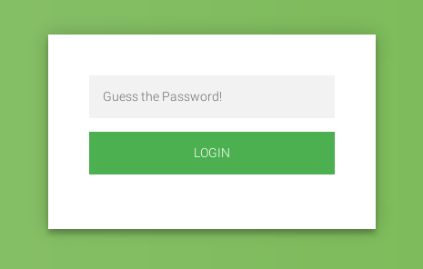
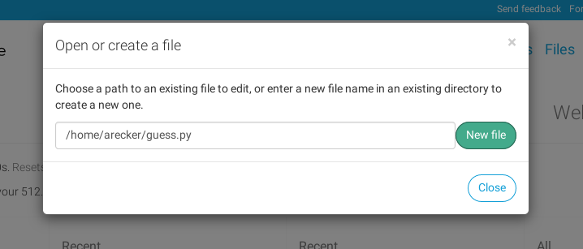
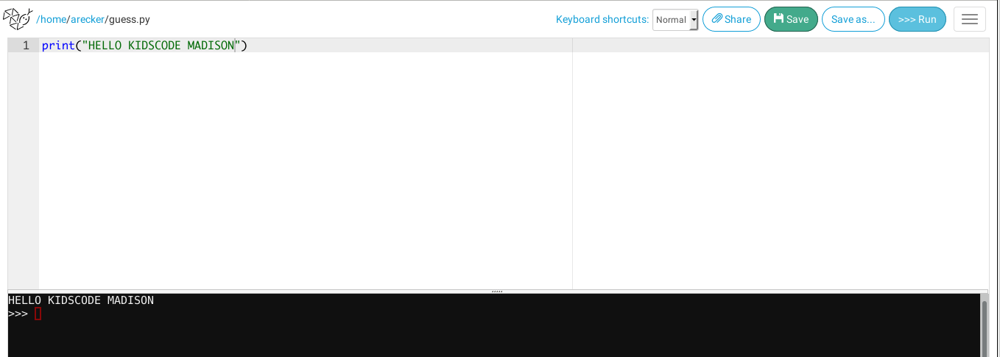

# Hacking Challenge



Go to this website and try to guess the password.  Try as many times as you'd like.

https://arecker.pythonanywhere.com/

Pretty tedious, huh?  Good thing we know how to write python.  Today we're going to write a python program that will guess the password for us.  All we'll need to do is give it a long list of password to try, then we just let it rip!  Let's get started.

First, let's create an empty file in our workstation.  I'm going to call mine `guess.py`, but feel free to name it whatever you'd like, as long as it doesn't have any weird characters in it.



This will take you to the python coding screen.  As we type code, you can run it by clicking the big blue **>>> Run** button in the top right.  Just to make sure we got that down, go ahead and enter this code.

```python
print("HELLO KIDSCODE MADISON")
```

Then click the **>>> Run** button.  You should see the message printed out.



Did you see the message?  If so, sweet!  If not, don't sweat it - just grab a friend or a KidsCode mentor.  They'll know what to do.

Now that we know our editor is working, delete all that.  First things first, we'll want to save off the URL of the website we're trying to hack in a variable.  Go ahead and enter this code in your editor.

```python
url = 'https://arecker.pythonanywhere.com'
print(url)
```

