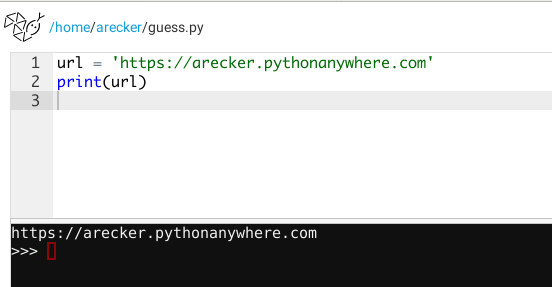

# Hacking Challenge


Go to this website and try to guess the password.  Try as many times as you'd like.

https://arecker.pythonanywhere.com/

Pretty tedious, huh?  Good thing we know how to write python.  Today we're going to write a python program that will guess the password for us.  All we'll need to do is give it a long list of password to try, then we just let it rip!  Let's get started.

First, let's create an empty file in our workstation.  I'm going to call mine `guess.py`, but feel free to name it whatever you'd like, as long as it doesn't have any weird characters in it.


This will take you to the python coding screen.  As we type code, you can run it by clicking the big blue **>>> Run** button in the top right.  Just to make sure we got that down, go ahead and enter this code.

```python
print("HELLO KIDSCODE MADISON")
```

Then click the **>>> Run** button.  You should see the message printed out.


Did you see the message?  If so, sweet!  If not, don't sweat it - just grab a friend or a KidsCode mentor.  They'll know what to do.

Now that we know our editor is working, delete all that.  First things first, we'll want to save off the URL of the website we're trying to hack in a variable.  Go ahead and enter this code in your editor.

```python
url = 'https://arecker.pythonanywhere.com'
print(url)
```



So we have the URL saved inside a variable within our program.  Normally, we would type that into a web browser, but is it possible to do that with python?  You bet it is!  We're going to need a little help though.  To do something complicated with python - like connect to a webpage - we're going to need to **import** a library.  Give this code a spin.

```python
url = 'https://arecker.pythonanywhere.com'

import requests
response = requests.get(url)
print(response)
```


What the heck does `Response [200]` mean?  It literally means "OK" in internet speak.  We've made a successful connection to a web page using python.  The result of the request is saved in our `response` variable.  When `response` is printed, it just shows up in our console as `<Response [200]>`, but behind the scenes there is a whole bunch of information we can access.  For instance, we can print the text of the response by just adding `.text`, like this.

```python
url = 'https://arecker.pythonanywhere.com'

import requests
response = requests.get(url)
print(response.text)
```


Woah, Nelly - that's a lot of text!  All that junk that was printed in the console is **HTML**.  When printed to your terminal, it looks like code.  That's just because your terminal doesn't know what to do with it.  Your **web browser**, on the other hand, knows how to turn the code into different fonts, colors, arrangments, and animations.

So we can connect to the web page with python, and now we can even read the web page in python, but how to we try to log in?  In your code, swap out `.get` with `.post`.

```python
url = 'https://arecker.pythonanywhere.com'

import requests
response = requests.post(url)
print(response.text)
```


What happened here?  In our first example, we used `.get()` to request information from a web page.  It turns out you can also submit information back to webpages.  This is what the `.post()` function does.  Just as before, we saved the response in a variable and printed the text, but this time we got a message back.  The website is telling us that "password" is required.

Just for kicks, visit https://arecker.pythonanywhere.com again in your browser again.  See what happens when you click "Login" without typing in a password.


p
See?  There's nothing magical happening in our python code.  It's doing the same thing as the web browser.   Just like our code, when you click "Login", it submits information back to the website.  Let's heed the website's warning and actually try sending a password.  Change your code to look like this.

```python
url = 'https://arecker.pythonanywhere.com'

import requests
response = requests.post(url, data={'password': 'hello'})
print(response.text)
```


Hey-hey-hey - we got something different back.  Don't be so pessimistic, friend.  Even a message that says `INCORRECT` is something to celebrate.  It means that we've figured out how to test password guesses in our program.  Let's create a list of password to try out.  Change your code to this.

```python
url = 'https://arecker.pythonanywhere.com'

guesses = [
    'hello', 'goodbye', 'cheeseburgers', 'hotdogs'
]

import requests

for guess in guesses:
    response = requests.post(url, data={'password': guess})
    print(response.text)
```


WOAH!  Let's recap.  So instead of just trying one password, we stuffed a whole bunch in a list of words, which we saved in the variable `guesses`.  Then, using **a for loop**, we performed the same code from before on each word.  As you may have guessed, the for loop goes through each word in the list, saving it in the variable `guess`.

**Not working?** No problem, just double check that...

- ...there is a **quote** around each word in our `guesses` list
- ...there is a **comma** between each word in our `guesses` list
- ...there is a **colon** after `for guess in guesses`

Let's tweak our code to print out the password it tried along with the response text.  This will make it easier to see what's going on.

```python
url = 'https://arecker.pythonanywhere.com'

guesses = [
    'hello', 'goodbye', 'cheeseburgers', 'hotdogs'
]

import requests

for guess in guesses:
    response = requests.post(url, data={'password': guess})
    print(guess + ': ' + response.text)
```


Great!  So now as our program is rolling through passwords, we can see which guesses it's making and which of them worked.  But how do we stop the program once it finds a correct guess?  First, instead of just printing `response.text`, let's save it off in a variable.

```python
url = 'https://arecker.pythonanywhere.com'

guesses = [
    'hello', 'goodbye', 'cheeseburgers', 'hotdogs'
]

import requests

for guess in guesses:
    response = requests.post(url, data={'password': guess})
    text = response.text
    print(guess + ': ' + text)
```

Now, we can use an **if statement** to compare the value of `text` with something.  What will `text` be if the password is correct?  If we knew that, then we wouldn't be writing a program to figure it out!  That might be unknown to us, but we definitely know what an incorrect guess looks like from all of our practice thus far.  Let's modify our code to exit the loop if the value of `text` is not equal to "INCORRECT".

```python
url = 'https://arecker.pythonanywhere.com'

guesses = [
    'hello', 'goodbye', 'cheeseburgers', 'hotdogs'
]

import requests

for guess in guesses:
    response = requests.post(url, data={'password': guess})
    text = response.text
    if text != 'INCORRECT':
        print('The correct password is ' + guess)
	break
    print(guess + ': ' + text)
```

Quick recap: our code is still trying each password in our `guesses` list, but after it receives a response from the website and saves the text in our `text` variable, it checks to see if `text` is not equal (or `!=` in python speak) to "INCORRECT".  If `text` is something different, then our program prints out a message then exits the loop with `break`.

You can run the code, but it's not going to look any different.  Did you think I would be dumb enough to put the correct password in the tutorial?  It's up to you to hack the website now.  Don't worry, armed with this program, you'll be able to find the correct password a lot faster than if you were doing it by hand.  With programs like this one, hackers can infiltrate their way into websites.  And since a program is doing all the work, they don't mind if it takes hours, days, weeks, months, or even years to find the right one.  Imagine if your program could send you a text message or an email when it found the correct match.  Worse yet, think of all the people who simply use the same password for every account.  If you find one, you find them all!

The moral of the story is this: pick good passwords.  If possible, use a tool to generate random characters.  As long as it's a password that a stranger couldn't guess, you'll be protected form brute force attacks.